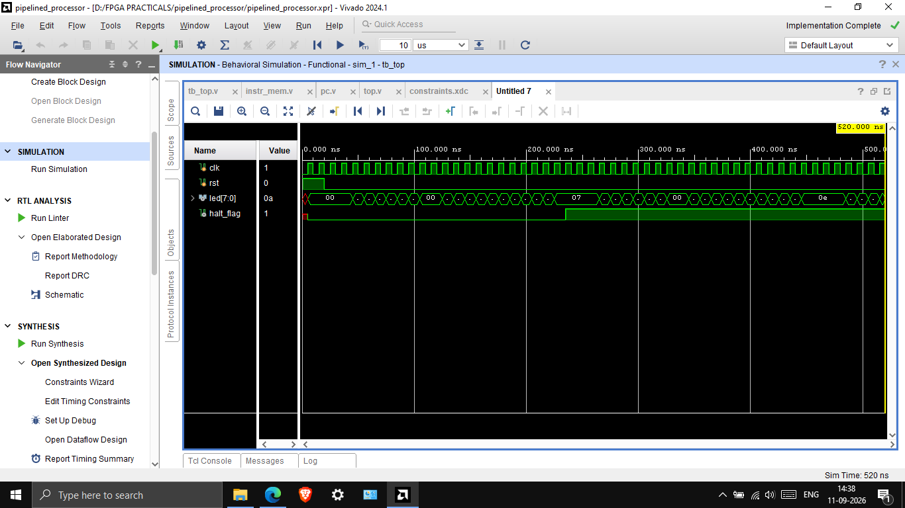

# 8-bit Pipelined RISC Processor (Verilog HDL)

An 8-bit, 3-stage pipelined RISC processor designed in **Verilog HDL** and implemented on **AMD Xilinx Vivado**, targeting a **Spartan-7 FPGA**.

The design covers instruction fetch, decode, ALU execution, pipeline registers, register file operations, RAW hazard detection with stalling, pipeline flush on `HALT`, and stable LED output — verified through simulation, RTL elaboration, synthesis, and hardware implementation.

## Features

- 8-bit processor datapath, 3-stage pipeline (IF → ID → EX)
- 8-bit ALU
- 8 × 8-bit register file
- Instruction memory
- Pipeline registers (IF/ID, ID/EX)
- Stall-based RAW hazard detection
- Pipeline flush on `HALT`
- Behavioral simulation (Vivado XSim)
- RTL and synthesized schematics
- FPGA implementation with stable LED output

## Instruction Set

| Instruction | Operation        |
| ----------- | ---------------- |
| ADD         | `Rd = Rd + Rs`   |
| ADDI        | `Rd = Rd + Imm`  |
| SUB         | `Rd = Rd - Rs`   |
| SLL         | `Rd = Rd << Imm` |
| HALT        | Stop processor   |

## Architecture

```
PC
 │
 ▼
Instruction Memory
 │
 ▼
IF/ID Register
 │
 ▼
Control + Register File
 │
 ▼
ID/EX Register
 │
 ▼
ALU
 │
 ▼
Result / LED Output
```

## Repository Structure

```
pipelined_processor/
├── README.md
├── LICENSE
├── Pipelined_Processor_Project_Report.pdf
│
├── pipelined_processor_project.srcs/           # Vivado source files & constraints
│   ├── sources_1/imports/src/                  # Verilog RTL source files
│   │   ├── top.v
│   │   ├── alu.v
│   │   ├── control.v
│   │   ├── pc.v
│   │   ├── reg_file.v
│   │   ├── if_id_reg.v
│   │   ├── id_ex_reg.v
│   │   └── instr_mem.v
│   ├── sim_1/imports/sim/                      # Testbench
│   │   └── tb_top.v
│   └── constrs_1/imports/constrs/              # FPGA Pin & clock constraints
│       └── constraints.xdc
│
├── pipelined_processor_project.sim/            # Vivado simulation directory
│   └── sim_1/behav/xsim/                       # Simulation scripts, logs & wave database
│       ├── compile.bat / elaborate.bat / simulate.bat
│       ├── tb_top_behav.wdb
│       └── *.log
│
└── Outputs/                                    # Waveform & schematic reports
    ├── RTL_Schematic.pdf
    ├── Synthesized_Schematic.pdf
    └── Waveform.png
```

- **`pipelined_processor_project.srcs/`**: Contains the complete Verilog RTL design sources (`sources_1`), simulation testbench (`sim_1`), and constraints file (`constrs_1`) for pin and clock mappings.
- **`pipelined_processor_project.sim/`**: Contains simulation run files, logs, and artifacts generated during Vivado behavioral simulation.
- **`Outputs/`**: Contains exported RTL and synthesized schematics along with the behavioral simulation waveform.

## Simulation Waveform



Behavioral simulation in Vivado XSim, showing `clk`, `rst`, `led[7:0]`, and `halt_flag`. The processor executes the instruction stream and correctly asserts `halt_flag` on reaching `HALT`.

## RTL Schematic

The RTL Schematic is available in [Outputs/RTL_Schematic.pdf](Outputs/RTL_Schematic.pdf).

## Synthesized Schematic

The Synthesized Schematic is available in [Outputs/Synthesized_Schematic.pdf](Outputs/Synthesized_Schematic.pdf).

## Tools Used

- Verilog HDL
- AMD Xilinx Vivado
- Vivado XSim
- FPGA synthesis and implementation flow (Spartan-7)

## How to Run

1. Clone this repository:
   ```bash
   git clone https://github.com/nigam-30/pipelined_processor.git
   ```
2. Open AMD Xilinx Vivado and create a new project targeting the Spartan-7 FPGA.
3. Add the design sources from `pipelined_processor_project.srcs/sources_1/imports/src/`.
4. Add the simulation testbench from `pipelined_processor_project.srcs/sim_1/imports/sim/tb_top.v`.
5. Add the constraints from `pipelined_processor_project.srcs/constrs_1/imports/constrs/constraints.xdc`.
6. Run **Behavioral Simulation** to inspect the waveform.
7. Run **Synthesis** and **Implementation** to view schematics and generate the bitstream.
8. Program the Spartan-7 FPGA to observe the physical LED output.

## Result

The processor was successfully simulated, synthesized, with RTL and synthesized schematics confirming the intended pipeline architecture.

## Author

**Nigam Mehta**  
[GitHub](https://github.com/nigam-30) · [LinkedIn](https://linkedin.com/in/nigam-mehta-83830528b)

## License

This project is licensed under the MIT License — see [LICENSE](LICENSE) for details.
